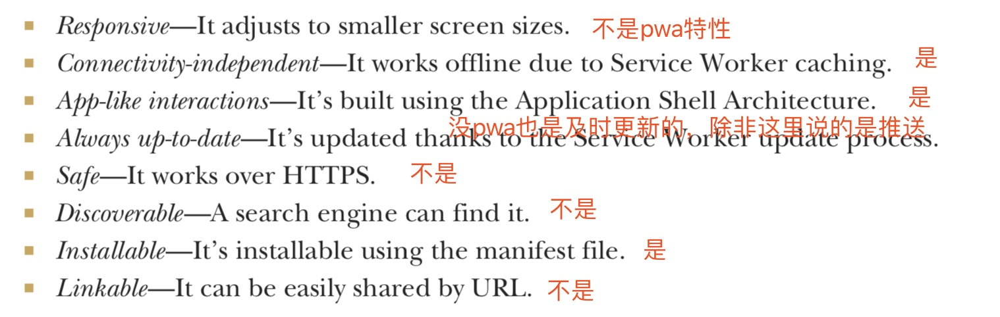

# PWA 摘要

## 第一部分 什么是 PWA

1. `PWA` 为何会存在 ？

`web app` 面临着 `wifi`、`4G`、`3G` 和 `2G` 的弱网甚至 `离线` 等复杂网络环境，以前要处理这些情况并不容易，而 `PWA` 就是为解决这一问题而诞生的。

###  第一章 了解 `PWA`

#### `PWA` 能做什么

`PWA` 能从哪些方面提升用户体验及背后的技术

1. 可以设置一些 `web App` 外观特性

	1. 背景色；
	2. 图标（与保留到桌面功能有关）；
	3. 默认的横竖屏方向；
	4. ...
	
	这些都可以通过 `manifest.json` 的配置文件设置。
	
2. `add to home screen` 可以将 `web App` 保留到桌面，方便下次打开

3. 利用 `service worker` 可以提升启动速度，甚至可以离线使用 

#### `PWA` 的核心技术 `service worker`

`service worker` 能够拦截网站的网络请求，处理 `push` 消息，若浏览器不支持 `service worker` ，便会回退到正常的 `web app`。是完美的`渐进增强`。

`service worker` 有如下特征：

1. 有自己独立的执行环境 - `worker context`，是独立的线程；
2. 不与特定的页面绑定，与 `应用` 绑定；
3. 操作不了 `DOM`
4. 只能运行在 `HTTPS` 环境里
5. 可以拦截所有网络请求（包括 `websockets` ?）
6. 事件驱动

#### `Service Worker` 生命周期

代码示例：

注册完后，就可以通过 `fetch` 事件，`拦截` 网络请求了

==没有sw源码==

### 第二章 初步搭建 `PWA` 应用

使用 `PWA` 的两种方式

####  在一个已有的项目的引入`PWA`
	
可利用 [lighthouse](https://github.com/GoogleChrome/lighthouse) 分析网站问题，根据需要引入 `PWA` 特性
	
####  分析 `PWA` 项目（从无到有写一个）

==书里这节是分析pwa主要涉及的方面==

1. 搭建 `App shell`
	
	`App shell` 指的是网站的内容骨架，如
	
	

	
	> 	搭建 `App shell`，区分内容与骨架，代码上方便管理（骨架相对稳定，内容多变，动静分离）；利用`sw` 缓存骨架还可以提升加载速度。
	
	书写 `sw`

	第一次加载
	
	
	
	> 	在 `install` 事件里缓存资源
	
	二次加载
	
	

	
2. `缓存`

	利用 `Service Worker toolbox` 处理缓存
	
	

3. 离线浏览
	
	`pwa` 缓存某个页面甚至整体网站，所以离线的时候，`开发者` 可以自定义离线页面，而不是展示浏览器默认页面，给`用户` 提供更好的体验。

4. 外观

	通过 `manifest` 文件里的设置，`PWA` 应用可以被安装到桌面上；也可以设置状态栏、启动页面颜色等。

5. 最终产品特性

	

3. `PWA` 一个优点是不需重写应用，也针对性地引用项目中能提升用户体验的特性。

## 第二部分 更快的 web App

### 第三章

### 第四章

## 第三部分 有吸引力的 web App

### 第五章

### 第六章

## 第四部分 适应力强的 web App

### 第七章 

### 第八章

### 第九章

## 第五部分 web App 的未来展望

### 第十章

### 第十一章

### 第十二章

